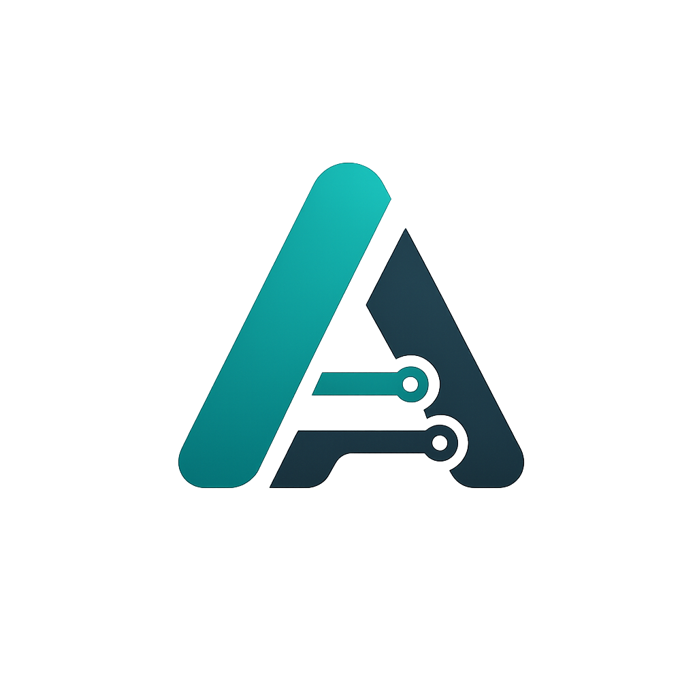

# AIControls - Local Agent Control Center

<p align="center">
  
</p>

<p align="center">
  <strong>CONTROL YOUR AGENTS. KEEP THE MAGIC LOCAL.</strong>
</p>

<p align="center">
  
  
  
  
  
</p>

**AIControls** 是一个运行在你自己电脑上的 AI Agent 控制台。它会扫描本机与项目里的 Agent 配置，把分散在 Cursor、Claude Code、Trae、Qoder、Kiro 里的 **Skills / MCP / Rules** 收拢到一个桌面应用里。

你可以把它理解成个人 AI 工作流的驾驶舱：看清楚有哪些能力、复制技能到不同 Agent、管理 Prompt 与资源链接、用 DeepSeek 做本地缓存的智能分类，再通过 Gitee 备份恢复你的配置。

**AIControls** is a local desktop control center for personal AI agents. It helps you discover, organize, copy, classify, and back up the agent assets that usually live across different tools and projects.

## What It Does

- **Agent inventory**: 自动发现 Cursor、Claude Code、Trae、Qoder、Kiro，并汇总全局与项目级 Skills、MCP、Rules。
- **Skill copy workflow**: 将技能包复制到全局或项目 Agent 目录，支持冲突处理与可见目标检测。
- **Prompt library**: 管理图片、代码、文档、纯文本 Prompt，支持分组、搜索、示例输出和图片示例。
- **Resource library**: 快速保存链接、标签和笔记，粘贴一段文本也能提取首个 URL。
- **AI classification**: 使用 DeepSeek 为技能、MCP、Rules 生成场景分类和简短说明，并优先读取本地缓存。
- **Backup and restore**: 通过 Gitee 同步配置，支持立即备份、断开连接和从仓库恢复。
- **Local-first desktop**: 基于 Tauri 构建，密钥与数据优先保存在本机应用数据目录。

## Supported Agents

Cursor · Claude Code · Trae · Qoder · Kiro

## Tech Stack

Tauri 2 · React 19 · Vite 6 · TypeScript · Rust

## Getting Started

```bash
npm install
npm run tauri dev
```

如果只想启动前端调试：

```bash
npm run dev
```

## Build

```bash
npm run build
npm run tauri build
```

## Scripts

```bash
npm run dev       # Vite dev server
npm run build     # Vite production build
npm run preview   # Preview built frontend
npm run test      # Vitest
npm run tauri     # Tauri CLI
```

## Notes

- DeepSeek API Key 只保存在本机，用于生成资产分类与摘要缓存。
- Gitee 同步需要在设置页配置 OAuth 应用信息与目标仓库。
- 桌面能力依赖 Tauri 后端；部分扫描、复制、备份功能需要在桌面端运行。
